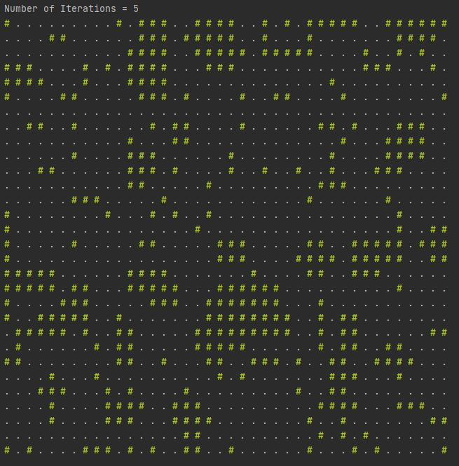

# 절차적 지도 생성 기법

절차적 지도 생성(Procedural Map Generation) 기법들을 설명하고 파이썬으로 구현한 페이지입니다.  
The same descriptions in English can be found at  [README(ENG).md](README(Eng).md).  

이 페이지는 개인 코딩 역량 증가와 게임 알고리즘 이해를 돕기위해 정리한 개인 프로젝트입니다.  
가장 최적화된 방법을 찾는게 아닌 알고리즘의 흐름을 이해하고 직접 구현해보자에 초점이 맞춰져 있기 때문에 틀리거나 비효율적인 점이 다소 존재할 수 있습니다.
  

**Work in progress**  
ToDo list
- Finish Code for each method  
- Colab Demo
- Animated examples
- English Translations

## 개요

로그라이크(Roguelike) 장르는 1980년에 탄생한 게임 Rogue의 특징과 시스템을 모방하여 만든 게임입니다. 
로그라이크의 여러 특징 중 절차적 지도 생성(Procedural Map Generation)기법은 원래 메모리의 한계를 극복하기 위해 개발된 기법이지만,
이론상 거의 무한에 가까운 가능성을 생성할 수 있다는 장점은 어느 게임이든 탐낼 수 밖에 없습니다.
실제로 Rogue 직후 발매된 게임들은 물론 최근에 발매된 게임들도 어느정도 요소를 채용하고 있습니다.
이 페이지는 2D 절차적 지도생성에 사용되는 기법과 알고리즘을 각각 소개하고, 그 알고리즘을 직접 파이썬으로 구현한걸 정리하기위해 만들어졌습니다.
각 기법마다 설명, 작동 방법, 파이썬 구현 코드, 데모 링크까지 추가할 예정입니다.

#### !! Shout out !!
- Cogmind: 제가 로그라이크에 대해 관심가지게 만든 게임 입니다.
- Rogue: 장르를 만들정도의 파급력을 가진 게임 요소를 처음으로 만든 게임입니다.
- [Herbert Wolverson - Procedural Map Generation Techniques](https://www.youtube.com/watch?v=TlLIOgWYVpI): 절차적 생성 알고리즘을 잘 설명해주고 시각화 해준 강의입니다. 사실상 이 페이지는 이 영상 실습편입니다.  

## Simple Room Placements

가장 기초가 되는 지도 생성 방법입니다. 방의 크기나 모양을 정하는 알고리즘에 따라 지도의 형태가 달라질 수 있습니다. Rogue의 경우 9개의 방을 생성하고 복도로 이어주는 방법으로 맵을 생성하였습니다.
이 세션에선 방을 어떤식으로 만드느지에 관해서 정리하였습니다. 추가 내용이 없다면 예시에서 지도의 크기는 40x30, 방의 크기는 가로세로 모두 2이상이고 10미만인 정수이며 서로다른 방은 인접할 수 없습니다.
 
### 기본 알고리즘
1. 지도를 벽으로 채운다.
2. 방의 위치와 크기를 정한다. 만약 그 자리에 방이 존재하지 않는다면 생성한다.
3. 계속 방을 생성한다.
4. 복도로 방을 잇는다.

### 완전 랜덤

code: [Random_Room_Gen](Random_Room_Gen.py)  
demo: WIP  

순수하게 다른 알고리즘 없이 랜덤으로 생성하는 방법입니다. 방은 단순하게 왼쪽 위를 앵커로 가로세로를 랜덤하게 구하였습니다.
1. 앵커의 좌표를 각각 0<=x좌표<map_width-2, 0<=y좌표<map_height-2인 정수중 랜덤으로 구합니다. 이때 map_width-2인 이유는 오른쪽과 아래에 칸1개짜리 방이 생기는것을 방지하기 위해서 입니다.
2. 가로와 세로 높이를 3<=가로,세로<10인 정수중 랜덤으로 구합니다.
3. 설정한 영역과 그 주변 1칸까지 기존 방이 없으면(최대값이 0이면) 방으로 표시합니다.

#### Tangent
랜덤하게 방 생성하기

### BSP Rooms

code: [BSP_Room_Gen](BSP_Room_Gen.py)  
demo: WIP 

Binary Space Partition Rooms의 약자로 Nethack에서 사용되었습니다. 랜덤 생성 방법과 유사하지만 더 방이 고르게 분포되게 만들 수 있습니다.
나누는 비율을 절반이 아닌 숫자로 정하거나 원하는 방의 크기가 나올때 까지 더 분할하면 더 유기적인 방을 생성할 수 있습니다.
1. 맵을 한개의 구역으로 정한다.
2. 구역을 랜덤으로 하나 정한다.
3. 구역을 가로 혹은 세로(랜덤 선택)로 나눈다.
4. 원하는 개수의 구역이 생성될 때 까지 2,3번을 반복한다.
5. 각 구역마다 한개 이하의 방을 생성한다.

이 알고리즘을 구현할 때 선택한 구역의 영역을 전달하는 방법에 대하여 고민을 했습니다. 구역을 절반으로 나누려면 영역의 크기를 정확하게 알고 있어야 합니다.
처음에는 매번 맵을 구성한 배열을 탐색하는 방법에 대하여 생각해 보았지만 맵의 크기가 커질 수록 오래 걸릴 수도 있겠다는 생각이 들었습니다.
Numpy.where함수를 쓰면 되지만 최대한 기초적인 라이브러리만 쓰기위해 사용하지 않았습니다.
결국 매번 n제곱의 배열탐색보단 각 구역의 크기 정보를 가진 딕셔너리를 사용하기로 정하였습니다.
마지막 구역을 나눈 후에 방이 붙어있는것을 막기위해 한 칸씩 줄였습니다.

## Cellular Automata

code: [Cellular Automata](Cellular_Automata.py)  
demo: WIP 

랜덤 맵으로 부터 정해진 규칙에 따라 Iteration을 거쳐 플레이 가능한 맵으로 변형하는 방법입니다.
Conway's Game of Life에서 사용되는 알고리즘입니다. 룰은 다음과 같습니다. 사용자가 원하는 결과에 맞게 룰을 조정할 수 있습니다.

1. 자신 주변(대각선 포함)에 존재하는 벽의 숫자를 셉니다.
2. 0이면 해당 타일은 벽이 됩니다.
3. 1~4면 해당 타일은 비어있게 됩니다.
4. 5~8이면 해당 타일은 벽이 됩니다.
5. 만족할 때 까지 Iteration을 계속 반복합니다.

이 알고리즘 구현할 때는 바운더리를 어떻게 처리하느냐에 따라 사람마다 다 다른 결과가 나오다는 특징이 있습니다.
저는 단순하게 벽의 수/이웃하는 칸의 수가 5/8이상일 때 벽을 생성하도록 코딩하였습니다.
맵이 생성될때 꽤 유기적으로 만들어지기 때문에 산이나 들판과 같은 오버월드를 생성할 때 유용하겠지만 인조 건축물이나 미로 던전은 생성하는데는 적합하지 않을 것 같습니다.

## Drunkard's Walk

code: [Drunkard's Walk](Drunkards_Walk.py)  
demo: WIP 

벽으로 이루어진 초기 맵에서 술고래 헐크가 부수고 지나간 길들을 모아 만든 맵입니다. 이 맵의 가장 큰 장점은 맵의 모든 길이 연결되어 있다는 점입니다.
물에의해 생긴 동굴과 유사한 점이 있어 지하 동굴을 만드는데 유용하게 사용할 수 있습니다.

1. 벽으로 이루어진 맵을 생성합니다.
2. 술취한 헐크를 맵 중앙에 생성하고 일정 걸음만큼 랜덤하게 움직입니다.
3. 헐크가 지나간 자리의 벽을 빈칸으로 지정합니다.
4. 빈칸의 수가 정해진 양만큼 생성되었을 때 까지 술취한 헐크를 랜덤 빈칸에 생성하며 2,3을 반복합니다.

이 알고리즘 구현하면서 생각해볼만한 부분은 처음 헐크를 배치하는 방법입니다. 빈칸일때까지 랜덤으로 선택하는 방법도 있겠지만 굴이 거의 뚤려있지 않을 경우 많은시도가 필요합니다.
따라저는 헐크가 지나간 길을 새로운 리스트에 업데이트 하는 방법을 사용하였습니다. 하지만 이 부분은 헐크가 여러번 지나간 타일이 중복될 수 있습니다.
매 사이클 마다 vacancy = list(set(vacancy))를 통해 리스트 vacancy의 중복을 제거하였습니다.

#### Tangent
max(2차원 리스트)

## Diffusion Limited Aggregation

code: [Diffusion Limited Aggregation](Diffusion_Limmited_aggregation.py)  
demo: WIP  
참고 페이지 : [Roguleike Tutorial - In Rust](https://bfnightly.bracketproductions.com/rustbook/chapter_30.html), [Roguebasin](https://www.roguebasin.com/index.php?title=Diffusion-limited_aggregation)  

유한 합산 집합체라는 어려운 이름을 가진 알고리즘입니다. 번개나 개미굴과 같은 프랙탈 모양의 방을 만들 수 있으며 룰을 변형하면 유기적이면서 독특한 맵을 만들 수 있습니다.
이 기법을 사용하면 생성한 맵의 모든 가지들이 연결되어있습니다. 
1. 맵을 전부 벽으로 채웁니다.
2. 맵 중앙에 빈칸 하나를 생성합니다.
3. 랜덤으로 한칸을 고릅니다.(이미 빈칸인 지역과 인접하지 않은 칸이 이상적입니다.)
4. 선택한 칸에서 랜덤한 방향으로 빔을 쏩니다.
5. 빔이 빈칸과 조우하였다면 만나기 직전의 벽을 빈칸으로 바꿉니다.
6. 빈칸의 숫자가 일정수준 넘을때까지 3~5를 반복합니다.

예제에서 빨간색0은 3번에서 선택한 칸, 파란색*는 빔, 빨간색#은 5번에서 새로 교체한 빈칸입니다.
코드 구현하면서 while문과 if문을 이렇게 남발한적은 처음인거 같습니다.
빔을 더 효과적으로 쏘는 방법이 있을텐데 저는 생각나지 않아 무식하게 직선 위 점들을 모두 확인하는 코드를 짰습니다.
While문은 조건을 조금만 잘못 생각하거나 사소한 오타가 나도 오류가 너무 커지기 때문에 선호하는 편은 아니지만, 더 나은 방법을 찾지 못해서 여러 반복문을 썼습니다.
당연히 무식하게 구현한만큼 버그도 존재합니다.

  
탄젠트 값의 절대 값이 매우 크면 생기는 오류로 보이며 전체적으로 코드를 손봐야 해서 일단은 남겨두었습니다.

### Center?

#### Tangent
삼각함수를 사용하지 않고 랜덤 방향을 정하는 방법?  
이 알고리즘 구현하면서 생각해볼만한 부분은 랜덤 방향으로 레이저는 쏘는 방법입니다.
물론 math라이브러리를 이용해 0~2pi사이 랜덤 값을 sin과 cos을 함수에 입력하는 방법으로 구현할 수 있지만,
추가 라이브러리를 사용하지 않고 이와 가장 유사하게 만들 수 있는 방법이 있는지 생각해 보았습니다.

## Voronoi Diagrams

code: [Voronoi Diagrams](Voronoi_Diagrams.py)  
demo: WIP

 맵에 랜덤적으로 시드를 설정하고 모든 칸을 가장 가까운 시드의 그룹에 포함시켜 지도를 생성하는 방법입니다.
 시드를 램덤하게 설정하면 매우 불규칙적인 맵이 생성되며 일정한 간격을 두고 설정하면 벌집과 같은 형태를 띄게 됩니다.
 또 거리를 계산하는 방법에 따라 서로 다른 느낌의 맵을 생성합니다.
 이 방법은 직접적인 맵 생성에 사용하기 보다 같은 그룹의 몬스터를 동일 셀에서 소환한다던지 서로 상반되는 세력은 멀리 떨어진 셀에 소환한다 같은 룰을 짜는데 도움을 줍니다.
 

같은 시드에서 거리 계산만 다르게 설정하였지만 맨해튼 거리는 인위적인 직선 거리로 형성되고,
체비쇼프 거리는 피타고라스와 맨해튼을 합친 결과와 비슷하게 나옵니다.

### Perlin/Simplex Noise
 